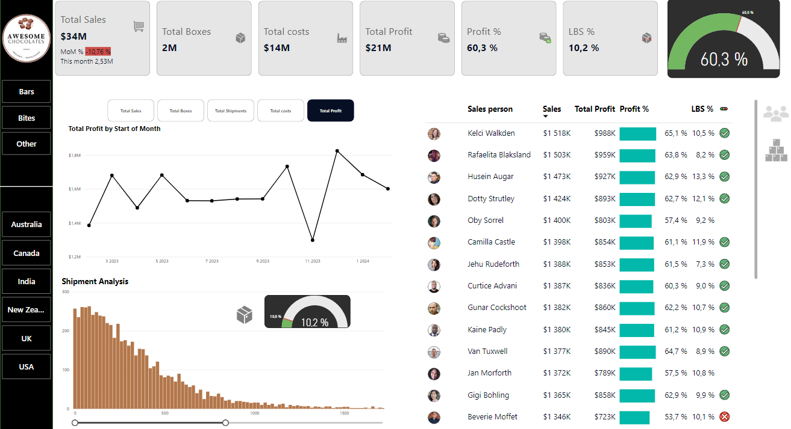

**Sales Analysis Project**
**Overview**
This project is focused on analyzing sales performance data to provide insights into key business metrics, trends, and opportunities. The analysis has been carried out using Microsoft Power BI, leveraging its robust visualization and data modeling capabilities.

**Key Objectives**
Sales Performance Tracking: Evaluate overall sales performance across different regions and time periods.
Customer Segmentation: Identify key customer groups contributing to revenue.
Profitability Analysis: Examine product categories and their profitability.
Trends and Forecasting: Highlight sales trends and make future projections based on historical data.
**Data Source**
Source of Data: The analysis was based on sales transaction records exported from the company's database or ERP system. The data includes:
Sales transactions
Product details
Customer information
Time-series sales data
The data was processed and visualized in Power BI to generate insights and reports.
**Tools Used**
Power BI: For data visualization and dashboard creation.
Tabular Data Models: Used to structure and analyze the dataset effectively.
Power Query: For data transformation and cleaning.
**Key Features of the Report**
Dynamic Dashboards: Interactive visuals to explore sales by region, product, and time.
KPIs: Displayed key metrics such as total sales, revenue growth, and profit margins.
Predictive Insights: Implemented basic forecasting models for sales trends.

